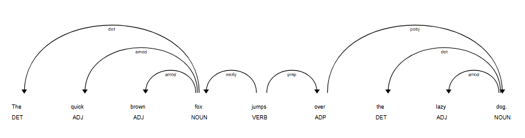

# Thực hành chuyên sâu về Phân tích cú pháp phụ thuộc (Dependency Parsing)

## 1. Mục tiêu
- Sử dụng thư viện `spaCy` để thực hiện phân tích cú pháp phụ thuộc cho một câu.
- Trực quan hóa cây phụ thuộc để hiểu rõ cấu trúc.
- Truy cập và duyệt cây phụ thuộc theo chương trình.
- Trích xuất thông tin có ý nghĩa từ các mối quan hệ phụ thuộc.
---
## 2. Triển khai
Toàn bộ mã nguồn được triển khai trong file : `NLP\Lab8\Lab8.ipynb`
---
### Phần 1: Giới thiệu và Cài đặt
---
### Phần 2: Phân tích câu và Trực quan hóa

- Cây phụ thuộc của câu `"The quick brown fox jumps over the lazy dog."`


```
Từ gốc (ROOT) trong câu 'The quick brown fox jumps over the lazy dog.' là : 'jumps'

Token: jumps
Dependents:
  - fox   | relation = nsubj
  - over  | relation = prep

Những từ mà 'fox' làm head:
- The         | dep = det
- quick       | dep = amod
- brown       | dep = amod
```
---
### Phần 3: Truy cập các thành phần trong cây phụ thuộc
- Kết quả phân tích các thuộc tính quan trọng của mỗi token trong câu: `"Apple is looking at buying U.K. startup for $1 billion"`

```
TEXT         | DEP        | HEAD TEXT    | HEAD POS | CHILDREN
----------------------------------------------------------------------
Apple        | nsubj      | looking      | VERB     | []
is           | aux        | looking      | VERB     | []
looking      | ROOT       | looking      | VERB     | ['Apple', 'is', 'at']
at           | prep       | looking      | VERB     | ['buying']
buying       | pcomp      | at           | ADP      | ['startup']
U.K.         | compound   | startup      | NOUN     | []
startup      | dobj       | buying       | VERB     | ['U.K.', 'for']
for          | prep       | startup      | NOUN     | ['billion']
$            | quantmod   | billion      | NUM      | []
1            | compound   | billion      | NUM      | []
billion      | pobj       | for          | ADP      | ['$','1']

```

- Giải thích các thuộc tính:
    - token.text: Văn bản của token.
    - token.dep_: Nhãn quan hệ phụ thuộc của token này với head của nó.
    - token.head.text: Văn bản của token head.
    - token.head.pos_: Part-of-Speech tag của token head.
    - token.children: Một iterator chứa các token con (dependent) của token hiện tại.
---
### Phần 4: Duyệt cây phụ thuộc để trích xuất thông tin
- Kết quả tìm các cạp `(chủ ngữ, động từ, tân ngữ)` trong câu : `"The cat chased the mouse and the dog watched them."`

```
Found Triplet: (cat, chased, mouse)
Found Triplet: (cat, chased, mouse)
Found Triplet: (cat, chased, mouse)
Found Triplet: (dog, watched, them)
Found Triplet: (dog, watched, them)
```

- Kết quả tìm các tính từ bổ nghĩa cho một danh từ trong câu : `"The big, fluffy white cat is sleeping on the warm mat."`

```
Danh từ 'cat' được bổ nghĩa bởi các tính từ: ['big', 'fluffy', 'white']
Danh từ 'mat' được bổ nghĩa bởi các tính từ: ['warm']
```
---

### Phần 5: Bài tập tự luyện

#### Bài 1: Tìm động từ chính của câu
- Câu : `"The quick brown fox jumps over the lazy dog."`
    ```python
    def find_main_verb(doc):
        """
        Trả về động từ chính (ROOT) trong câu.
        Nếu không tìm thấy ROOT phù hợp, trả về None.
        """
        ...
        # Trường hợp hiếm: ROOT không phải VERB (ví dụ câu mệnh lệnh, câu bị động)
        ...
        return token

    doc = nlp("The quick brown fox jumps over the lazy dog.")
    print(f"Động từ chính của câu '{doc.text}' là:",find_main_verb(doc))
    ```
- Kết quả: 
    ```python
    Động từ chính của câu 'The quick brown fox jumps over the lazy dog.' là: jumps
    ```
---
#### Bài 2: Trích xuất các cụm danh từ (Noun Chunks)
- Câu `"The quick brown fox jumps over the lazy dog near a small river."`

    ```python
    def extract_noun_chunks(doc):
        """
        Tự trích xuất các cụm danh từ mà không dùng doc.noun_chunks.
        Ý tưởng:
        - Chọn các token là NOUN hoặc PROPN
        - Lấy các từ bổ nghĩa thuộc nhóm (det, amod, compound, nummod, poss)
        - Lấy thêm các từ mở rộng bên trái/phải
        """

        noun_chunks = []

        # Các quan hệ bổ nghĩa thường gặp của danh từ
        modifiers = {"det", "amod", "compound", "nummod", "poss"}

        for token in doc:
            ...

        return noun_chunks

    doc = nlp("The quick brown fox jumps over the lazy dog near a small river.")
    print(f"Các cụm danh từ trong câu '{doc.text}' là:\n {extract_noun_chunks(doc)}")
    ```

- Kết quả:
    ```
    Các cụm danh từ trong câu 'The quick brown fox jumps over the lazy dog near a small river.' là:
    ['The quick brown fox', 'the lazy dog', 'a small river']
    ```
---
#### Bài 3: Tìm đường đi ngắn nhất trong cây
- Câu : `"The quick brown fox jumps over the lazy dog."`

    ```python
    def get_path_to_root(token):
        """
        Trả về đường đi từ token hiện tại lên đến ROOT.
        Đường đi là một list token, bắt đầu từ token và kết thúc ở ROOT.
        """
        path = [token]
        current = token
        ...
        return path
    token = nlp("The quick brown fox jumps over the lazy dog.")[2]
    print(f"Danh sách các token trên đường đi từ '{token.text}' đến ROOT là:\n {get_path_to_root(token)}")
    ```
- Kết quả:
    ```python
    Danh sách các token trên đường đi từ 'brown' đến ROOT là:
    [brown, fox, jumps]
    ```
---

## 3. Kết luận

Lab 8 cung cấp một hướng dẫn thực tiễn về **Phân tích cú pháp phụ thuộc (Dependency Parsing)** sử dụng thư viện `spaCy`. Qua các phần thực hành, chúng ta đã:

1. **Hiểu rõ cây phụ thuộc:** Mỗi token có mối quan hệ với một token khác (head) thông qua các nhãn phụ thuộc (nsubj, dobj, amod, prep, v.v.).

2. **Trực quan hóa và truy cập:** Sử dụng `displacy.render()` để hiển thị cây phụ thuộc, và các API như `token.head`, `token.children`, `token.dep_` để truy cập thông tin.

3. **Trích xuất thông tin thực tế:** Áp dụng dependency parsing vào các bài toán cụ thể như tìm chủ ngữ-động từ-tân ngữ, trích xuất cụm danh từ, và phân tích cấu trúc câu.

4. **Giải quyết các vấn đề thực tiễn:** Xử lý đúng các trường hợp đặc biệt như dấu câu, câu phức tạp, và mở rộng thông tin từ cây phụ thuộc.

**Ý nghĩa:** Dependency parsing là nền tảng cho nhiều bài toán NLP nâng cao như trích xuất quan hệ, phân tích cảm xúc, hiểu biết văn bản, và xử lý ngôn ngữ tự nhiên tổng quát.

---

### 4. Tài liệu tham khảo
1. **spaCy Documentation - Dependency Parsing**
   - https://spacy.io/usage/linguistic-features#dependency-parse

2. **Universal Dependencies Project**
   - https://universaldependencies.org/

3. **spaCy Models**
   - https://spacy.io/models

4. **spaCy Course**
   - https://course.spacy.io/

5. **Linguistic Features in spaCy**
   - https://spacy.io/usage/linguistic-features

6. **A Fast and Accurate Dependency Parser using Neural Networks** (Chen & Manning, 2014)

7. **Transition-Based Dependency Parsing with Stack Long Short-Term Memory** (Dyer et al., 2015)
---
